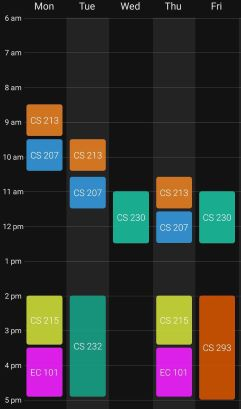

# Important Dates

(Maybe here quizzes/deadline dates can be mentioned, along with the syllabus for the quizzes/exams)

# Timetable

# Course Policies

## CS 207

3 quizzes, each 10% (best 2/3 will be chosen): 20% \
Midsem: 30% \
Endsem: 50%

## CS 213

Attendance quizzes: 5% \
2 quizzes, each 12.5%: 25% \
Midsem: 30% \
Endsem: 40%

## CS 215

First Half: Quiz (10%) + Midsem (40%) \
Second Half: Quiz (10%) + Endsem (40%)

## CS 230

Surprise Safe Quizzes, best 8/10: 20% \
3 Quizzes, each 35% (best 2/3 will be chosen): 70% \
Memes: 10%

## CS 231

Lab 1: 10% \
Lab 2: 20% \
Lab 3 (3 parts, each worth 10%): 30% \
Lab 4 (2 parts, each worth 20%): 40%

## CS 293

3 lab exams, each worth 20%: 60% \
Project: 40%

## EC 101

First Half: Quiz (15%) + Midsem (35%) \
Second Half: Quiz (15%) + Endsem (35%)
